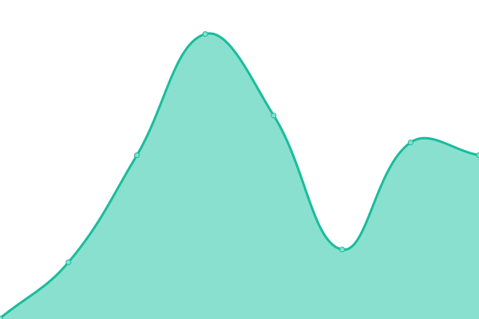
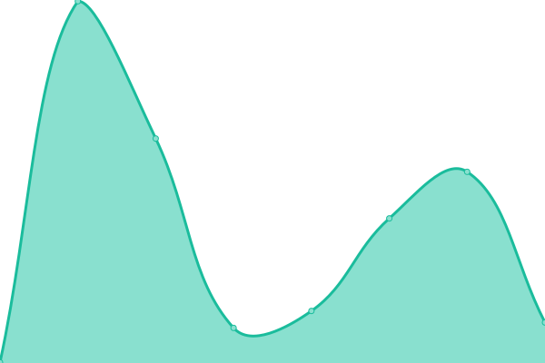

<!--start: status pages-->
<!-- This summary is generated by Upptime (https://github.com/upptime/upptime) -->
<!-- Do not edit this manually, your changes will be overwritten -->
<!-- prettier-ignore -->
| URL | Status | History | Response Time | Uptime |
| --- | ------ | ------- | ------------- | ------ |
|  [Site](https://strike.financial) | 🟥 Down | [site.yml](https://github.com/StrikeFinancial/status/commits/HEAD/history/site.yml) | 

 232ms
     
 | 

<a href="https://status.strike.financial/history/site">0.00%</a>
    

|  [Login](https://login.strike.financial) | 🟥 Down | [login.yml](https://github.com/StrikeFinancial/status/commits/HEAD/history/login.yml) | 

 271ms
     
 | 

<a href="https://status.strike.financial/history/login">0.00%</a>
    

|  [Signup](https://signup.strike.financial) | 🟥 Down | [signup.yml](https://github.com/StrikeFinancial/status/commits/HEAD/history/signup.yml) | 

 212ms
     
 | 

<a href="https://status.strike.financial/history/signup">0.00%</a>
    

|  [App](https://app.strike.financial) | 🟥 Down | [app.yml](https://github.com/StrikeFinancial/status/commits/HEAD/history/app.yml) | 

 214ms
     
 | 

<a href="https://status.strike.financial/history/app">0.00%</a>
    

<!--end: status pages-->
